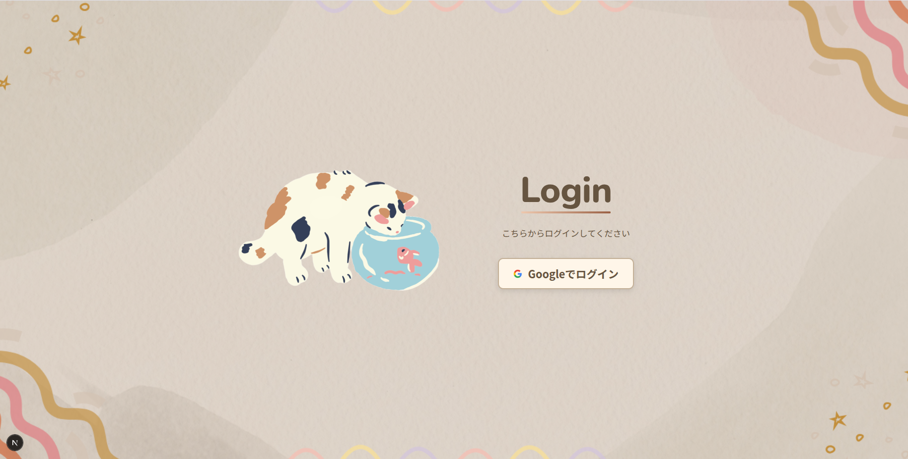
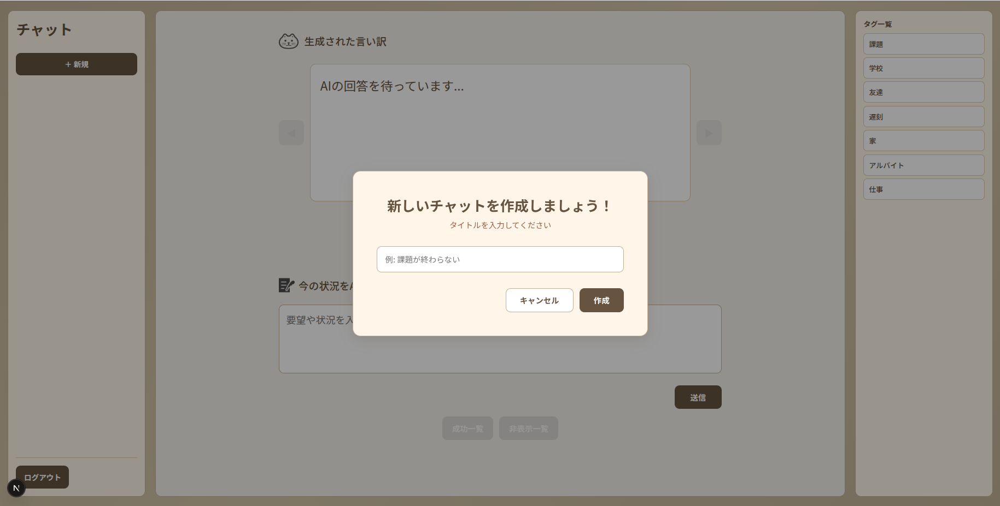
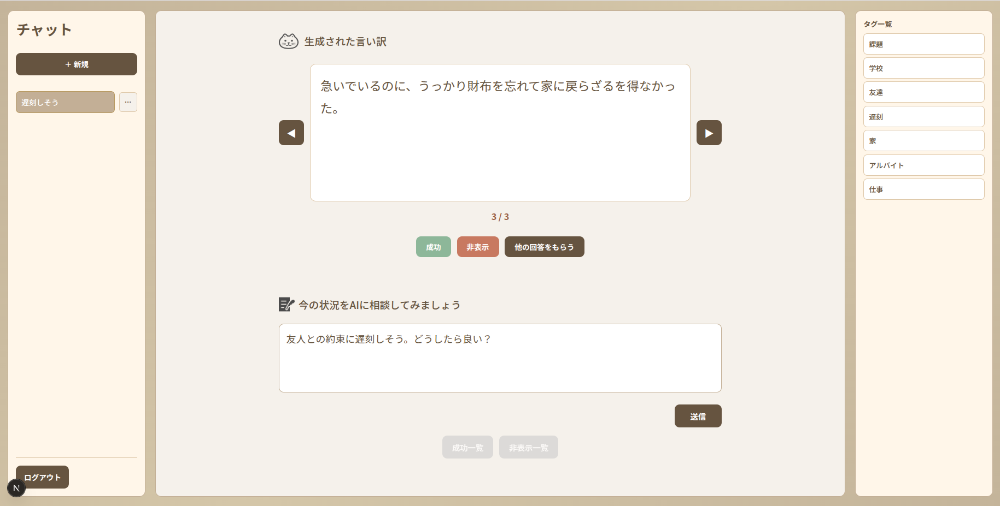
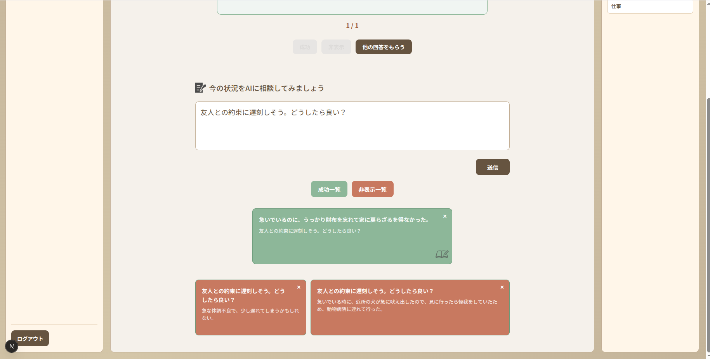
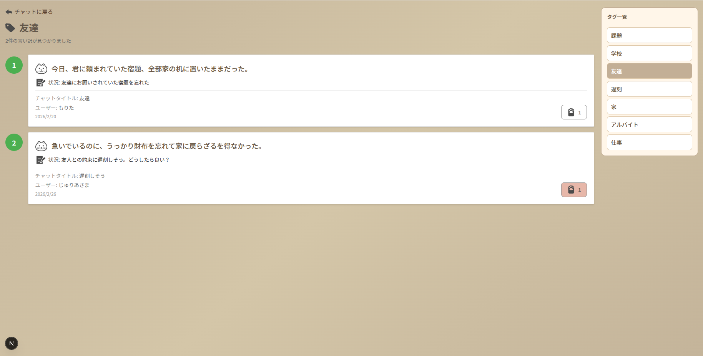

# 言い訳生成アプリ
制作日： 2年生 2025年12月

制作期間： 2ヶ月

## 概要
このアプリは、ユーザが入力した状況に対して、Gemini Aiが適切な言い訳を生成します。
ユーザは生成された言い訳を「成功」や「非表示」として管理でき、タグごとのランキングも確認できます。 
制作理由：AIを取り入れて、エンタメ性のあるアプリを作りたかったからです。

## スクリーンショット

<strong>使い方</strong>

1. Googleアカウントでログインしましょう 

2. まずはチャットの新規作成から始めます 
 

3. 状況を入力して「送信」ボタンをクリックすると、言い訳が生成されます 
 

4. 「成功」ボタンと「非表示」ボタンから生成された言い訳を管理できます 
    「成功一覧」ボタンと「非表示一覧」ボタンから、管理した言い訳を確認できます 
 

5. 「成功一覧」から言い訳を選択して、タグごとのランキングに反映しましょう 
 

6. タグ一覧から、タグごとのランキングが確認ができるようになります 
 

## 機能
* 新規チャット作成
* 生成された言い訳が成功したかの判定
* 成功した言い訳を共有する機能
* 共有された言い訳をいいねする機能
* ランキング表示機能

## 使用技術
* 言語：JavaScript / TypeScript / HTML / CSS
* フレームワーク：Express / Next.js
* データベース：Supabase（PostgreSQL）
* ORM：Prisma
* デプロイ：Vercel / Render
* 認証：Firebase Authentication
* AI：Google Gemini API
